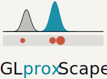
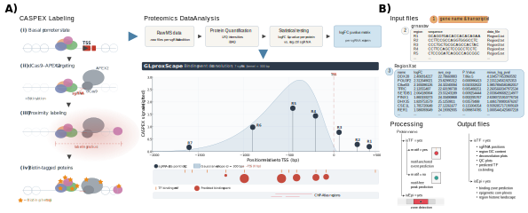

<p align="center">
  <picture>
    <source media="(prefers-color-scheme: dark)"  srcset="man/figures/GLproxScape-dark.svg">
    <source media="(prefers-color-scheme: light)" srcset="man/figures/GLproxScape-light.svg">
    
  </picture>
</p>

# GLproxScape

<!-- badges: start -->
[](https://github.com/scanozcan/GLproxScape/actions/workflows/R-CMD-check.yaml)
[](LICENSE)
[](https://lifecycle.r-lib.org/articles/stages.html#experimental)
[](https://doi.org/10.5281/zenodo.20337799)
[](#)
<!-- badges: end -->

Spatial reconstruction of chromatin occupancy landscapes from
**genomic locus proximity proteomics** (e.g. dCas9-APEX2 / CASPEX,
C-BERST, CasID).

GLproxScape treats per-region enrichments from tiled-sgRNA experiments
as indirect spatial measurements and reconstructs the latent
chromatin-binding landscape via a Gaussian labelling-kernel forward
model. Each guide's biotinylation footprint is modelled as a Gaussian
cone (default σ = 300 bp); per-region enrichment values are
forward-smeared into a continuous spatial track *s(x)*, normalised by
guide coverage *C(x)* to recover an occupancy estimate β(x) = s(x) /
max(C(x), c_min · max C). Each protein is classified against curated
transcription-factor and chromatin-regulator lists and routed through
one of three analytical paths:

* **Motif-anchored deconvolution** for transcription factors with a
  motif entry. Non-negative least squares against a
  position-weight-matrix basis (JASPAR by default, HOCOMOCO v12 optional
  via `motif_search_engine`) recovers discrete binding events with
  bp-level positions and per-event amplitudes.
* **Motif-free peak prediction** for transcription factors absent from
  the motif database. Peaks are called directly on the spatial signal
  *s(x)*, so motif-less TFs still receive position predictions (flagged
  `motif_based = FALSE` in the events table).
* **Zone-based detection** for chromatin regulators that lack
  sequence-specific motifs. Broad occupancy zones are detected directly
  on the labelling intensity, enabling recovery of overlapping members
  of multi-subunit complexes (e.g. MLL4/WBP7).

An optional ChIP-Atlas overlay cross-references each prediction
against independent public ChIP-seq peaks for orthogonal validation.

The package is the analysis backbone behind the GLproxScape paper
(Ozcan *et al.* 2026) and ships a bundled reanalysis of the
MacKenzie *et al.* (2026) FOXP2 dataset (3 sgRNAs) as an end-to-end
example.

<p align="center">
  
</p>

<p align="center">
  <em>From CASPEX proximity labelling and per-region proteomics to a
  deconvolved chromatin-occupancy landscape — inputs, processing, and
  outputs at a glance.</em>
</p>

## Install

```r
# install.packages("remotes")
remotes::install_github("scanozcan/GLproxScape", build_vignettes = TRUE)
```

`build_vignettes = TRUE` builds the FOXP2 walkthrough during install so
`vignette("foxp2-mackenzie", package = "GLproxScape")` is available;
drop it for a faster install if you don't need the vignette HTML.

**Requirements.** `run_caspex()` queries live web services on every
run: Ensembl (gene lookup + promoter sequence) and JASPAR (motif
PWMs), so an internet connection is required. Optional services are
fetched only when enabled and cached locally after the first call —
ChIP-Atlas peaks (`chipatlas = TRUE`) and the HOCOMOCO bundle
(`motif_search_engine = "hocomoco"`), both cached under
`tools::R_user_dir("caspex", "cache")`.

## Quick start

```r
library(GLproxScape)

# Use the bundled FOXP2 example dataset (MacKenzie et al., 2026)
inputs_dir <- system.file("extdata/examples/foxp2_mackenzie",
                          package = "GLproxScape")
inputs <- load_caspex_inputs(inputs_dir)

res <- run_caspex(
  gene             = "FOXP2",
  transcript       = "ENST00000901759",   # MacKenzie's HEK293 active TSS1
  grnas            = inputs$grnas,
  data_files       = inputs$data_files,
  upstream         = 200,
  downstream       = 2000,
  out_dir          = tempfile("foxp2_run_"),
  weight_mode      = "lfc_signed",
  pval_thresh      = 0.5,
  motif_thresh     = 0.75,
  chipatlas        = FALSE,               # set TRUE for the ChIP-Atlas overlay (slow on a cold cache)
  extras           = TRUE,                # diagnostic plot pack       -> <out_dir>/extras/
  epigenetic       = TRUE                 # chromatin-factor zone deck -> <out_dir>/epigenetic/
)

# Inspect the top-N predicted binding events
head(res$binding_events[order(-res$binding_events$weight), ], 10)
```

`chipatlas = FALSE` keeps this Quick start fast; flip to `TRUE` to
add the orthogonal-validation track from public ChIP-seq peaks (one
download per scanned TF on first run; cached locally thereafter).

A single `run_caspex()` call writes the full deliverable set to
`out_dir`: the main TF deck (gRNA layout, per-region heatmap,
motif-track PDF, per-TF deconvolution detail pages, binding-events
CSV), the diagnostic plot pack under `<out_dir>/extras/`, and the
zone-based chromatin-factor deck under `<out_dir>/epigenetic/`. The
returned object exposes the corresponding R objects as
`res$spatial_df`, `res$motif_results`, `res$binding_events`,
`res$extras_result`, and `res$epigenetic_result`. Set
`extras = FALSE` or `epigenetic = FALSE` to skip either downstream
phase; pass phase-specific parameters via
`extras_args = list(...)` / `epigenetic_args = list(...)`.

The two phase functions are also exported and accept the `res` object
directly — useful for re-running just one phase while keeping the
main TF deck cached in memory:

```r
extras_out <- run_caspex_extras(res, out_dir = file.path(res$out_dir, "extras"))
epi_out    <- run_caspex_epigenetic(res, out_dir = file.path(res$out_dir, "epigenetic"))
```

## How to use it on your own data

GLproxScape expects each promoter-tiling experiment to live in a
folder with one **manifest** file plus one **proteomics table** per
gRNA region. Once the folder is laid out, the entire analysis is two
function calls — `load_caspex_inputs()` to read the manifest, then
`run_caspex()` for everything else.

### Folder layout

```
my_gene_analysis/
├── inputs/
│   ├── grnas.tsv        ← manifest: which gRNA is which region, and where its data lives
│   ├── Region1.txt      ← per-region proteomics table (one per sgRNA)
│   ├── Region2.txt
│   ├── Region3.txt
│   └── ...
└── analysis.R           ← your runner script (whatever you want to call it)
```

The folder name is up to you. What matters is that `inputs/grnas.tsv`
points at the `Region*.txt` files that sit next to it.

### `grnas.tsv` — the manifest

A tab-separated file with three required columns: `region`, `sequence`,
`data_file`. One row per gRNA region. Lines starting with `#` and blank
lines are ignored, so the top of the file can carry provenance notes.

```
# YOUR_GENE promoter tiling — replace with your sgRNA sequences.
# Lines beginning with `#` are ignored; useful for provenance notes
# (assembly, chromosome, strand, etc.).
region	sequence	data_file
R1	GAAATCCAGGAGTCATATAA	Region1.txt
R2	GGCAGTCAATATCATACCAG	Region2.txt
R3	AGTAGACAGGTCAACCATTG	Region3.txt
R4	GAATGGAGGCAGTGCTACTA	Region4.txt
R5	TCAGCACTATATACATATGG	Region5.txt
R6	TTCTGAAGAGATAGCAACAA	Region6.txt
R7	TTGATGCTCAATGGAGGTGT	Region7.txt
```

Notes:
- `region` IDs are arbitrary labels (`R1`, `R2`, ... or `5kb`,
  `proximal`, `TSS`, anything you like). They become the column
  prefixes in the engine's outputs and the lane labels on plots.
- `sequence` is the protospacer (typically 20 bp). The PAM is optional;
  the engine matches against the promoter sequence with or without it.
  Every listed region must have a real gRNA sequence — the pipeline
  cannot place a region in space without one.
- `data_file` is the per-region proteomics table filename, resolved
  relative to the manifest's folder.

### `Region*.txt` — the per-region proteomics tables

Each table is the **differential proteomics result for one sgRNA
region** — the enrichment of that region's proximity-labelled
pulldown against a control (e.g. a no-guide / non-targeting
condition), computed by you upstream of GLproxScape (the bundled
FOXP2 example uses a per-sgRNA logFC vs. no-guide; see the paper for
the full design). GLproxScape consumes these per-region contrasts as
its spatial measurements — it does not compute differential
enrichment from raw abundances for you.

Tab-separated tables with at minimum a protein-name column, a logFC
column, and a p-value column. An optional moderated-t column is also
recognised. Column-name matching is case-insensitive and tolerates
common aliases:

```
name	logFC	P.Value	t
POLL	1.648799	0.0164533	2.981229
ETFA	1.523198	0.0643181	2.125487
ZNF286B	0.993416	0.179416	1.463346
GPC6	0.965345	0.064466	2.124047
...
```

Recognised name aliases:
- protein column: `name`, `gene`, `protein`, `symbol`
- logFC column: `logFC`, `log2FC`, `log_fc`
- p-value column: `P.Value`, `pvalue`, `p_value`, `p`
- moderated t (optional): `t`, `t_stat`, `moderated_t`

If you don't have a `t` column, GLproxScape derives a signed z-score
from the p-value as the default weight (`weight_mode = "z"`). If you
do have moderated-t from limma, set `weight_mode = "mod_t"` in
`run_caspex()` to use it.

The TF vs. chromatin-factor classification is handled inside
`run_caspex()` by auto-loading the bundled `TFLibrary.txt` and
`EpiGenes_main.csv`. To pin a custom universe, pass a character vector
to `tf_universe` or `epi_universe` and it overrides the bundled
default. No TF column is needed inside the per-region tables.

The protein column should hold HGNC symbols. Anything else (Ensembl
IDs, UniProt accessions) won't intersect cleanly with the JASPAR
motif database or the bundled TF / EpiFactors universes.

### Picking the right transcript anchor with `check_transcripts()`

Do this **before** running the pipeline — the transcript you pick
sets the TSS that every coordinate is measured from. Most genes have
several alternative promoters, and the canonical Ensembl transcript
isn't always the one your sgRNAs target. Running against the wrong
transcript can silently produce zero sgRNA matches (and therefore
zero meaningful predictions). Use `check_transcripts()` to choose
the `transcript = "ENST..."` argument:

```r
library(GLproxScape)
df <- check_transcripts(
  gene          = "YOUR_GENE",
  manifest_path = "my_gene_analysis/inputs"
)
head(df, 5)
```

The function prints a per-transcript table to the console — one row
per Ensembl transcript, with the TSS coordinate, biotype, canonical
flag, and which sgRNAs matched at which TSS-relative bp position. It
finishes with a one-line recommendation like:

```
=== Recommendation ===
Best transcript: ENST00000XXXXXXX  (N / N sgRNAs matched)
Use in run_caspex():  transcript = "ENST00000XXXXXXX"
```

Paste the recommended ENST into `run_caspex(transcript = ...)` and
you're done.

The recommendation just picks the transcript with the most sgRNA
matches — usually right, but not always. The canonical Ensembl
transcript isn't necessarily the one your experiment targeted: a
gene can have several promoters, and the one active in your cell
type may sit on a non-canonical alt-promoter far from the canonical
TSS. (FOXP2's HEK293 "active TSS1" (MacKenzie *et al.*, 2026), for
example, sits hundreds of kb upstream of the canonical FOXP2-201
TSS.) You know which promoter your sgRNAs were designed against, so
when the recommendation looks off, inspect the full data.frame and
pick the ENST whose TSS coordinate places your sgRNAs where you
designed them to land. If no transcript matches any sgRNAs,
double-check the HGNC symbol, the species, and whether your sgRNA
sequences come from the genome build Ensembl is currently serving.

### Running the analysis

Once the folder is laid out, the runner is short. From an R session
opened in the parent folder:

```r
library(GLproxScape)

# 1) Load the inputs
inputs <- load_caspex_inputs("my_gene_analysis/inputs")

# 2) Run the full pipeline
res <- run_caspex(
  gene             = "YOUR_GENE",            # HGNC symbol
  transcript       = "canonical",          # or "ENST..." for an alt-promoter
  grnas            = inputs$grnas,
  data_files       = inputs$data_files,
  upstream         = 3250,                  # bp window upstream of TSS
  downstream       = 100,                   # bp window downstream of TSS
  out_dir          = "my_gene_analysis/caspex_output",
  weight_mode      = "z",
  motif_thresh     = 0.75,                  # JASPAR PWM threshold (frac of max)
  chipatlas        = TRUE,                  # set FALSE if you don't want the overlay
  extras           = TRUE,                  # diagnostic plot pack       -> <out_dir>/extras/
  epigenetic       = TRUE                   # chromatin-factor zone deck -> <out_dir>/epigenetic/
)
```

**Setting the promoter window.** `upstream` and `downstream` define
the analysis window as `[-upstream, +downstream]` bp around the TSS
of the chosen transcript. The window must span the genomic stretch
your sgRNAs tile across — any sgRNA whose match position falls
outside it is silently dropped, the same failure mode as picking the
wrong transcript. The `check_transcripts()` table above reports each
sgRNA's TSS-relative bp position for your chosen ENST; size the
window to comfortably bracket that range (the example's asymmetric
`3250 / 100` simply reflects sgRNAs tiling upstream of the TSS).
There is no single right value — match it to where your guides sit,
not to the defaults.

`extras` and `epigenetic` are TRUE by default; set either to `FALSE`
to skip the corresponding phase. Pass phase-specific parameters via
`extras_args = list(...)` / `epigenetic_args = list(...)` without
bloating the main signature.

After this, `my_gene_analysis/caspex_output/` contains the
binding-deconvolution PDF, the per-region heatmap, the gRNA-positions
plot, and the predictions CSVs.

### Reading the output

The primary result is the binding-events table — written to CSV and
returned as `res$binding_events`. One row per predicted binding event:

```r
head(res$binding_events[order(-res$binding_events$weight), ], 10)
```

Key columns:
- `tf` — the predicted factor (HGNC symbol).
- `position` — **TSS-relative bp** of the event: negative is
  upstream of the TSS, positive is downstream. This is the same
  coordinate frame as the `check_transcripts()` sgRNA positions, so
  events land in the span your guides tile.
- `weight` — the deconvolved event amplitude (recovered occupancy).
  Higher = stronger predicted binding; rank by this to read off the
  top calls.
- `motif_based` — `TRUE` if the event is anchored to a JASPAR/HOCOMOCO
  motif hit (sequence-specific TF path), `FALSE` if it came from the
  no-motif peak detector.
- `distance_to_nearest_grna` / `local_coverage` — how far the event
  sits from the nearest sgRNA and the labelling coverage there;
  events far from any guide or in low-coverage gaps are less reliable.

The zone-based predictions for epigenetic factors live separately on
`res$epigenetic_result` and under `<out_dir>/epigenetic/`. The deconvolution PDF visualises the
same events as bubbles along the promoter; the per-region heatmap and
gRNA-positions plot are diagnostics for the underlying signal.

## `run_caspex()` parameter reference

Full list of every argument, its default, and the allowed values. Use
this as a quick lookup; the same content lives (with longer prose) in
`?run_caspex`.

#### Required inputs

- `gene` — HGNC symbol (e.g. `"FOXP2"`).
- `grnas` — named character vector of protospacer sequences (17-23 bp).
- `data_files` — named character vector of per-region proteomics table paths.

#### Annotation universes

- `tf_universe` = `NULL` — character vector of HGNC TF symbols. `NULL`
  auto-loads the bundled `inst/extdata/databases/TFLibrary.txt`.
- `epi_universe` = `NULL` — character vector of chromatin-factor HGNC
  symbols. `NULL` auto-loads the bundled
  `inst/extdata/databases/EpiGenes_main.csv` (`HGNC_symbol` column).
- `tfs_only` = `TRUE` — restrict the spatial model to rows with
  `isTF = TRUE`. `FALSE` includes every protein.

#### Promoter window

- `species` = `"homo_sapiens"` — Ensembl species token.
- `transcript` = `"canonical"` — `"canonical"` | `"ENST..."` | `NA`
  (legacy gene-level union; not recommended).
- `upstream` = `2500` — bp upstream of TSS.
- `downstream` = `500` — bp downstream of TSS.

#### Spatial model + TF selection

- `pval_thresh` = `0.05` — per-region p-value gate.
- `min_regions` = `2` — minimum regions for a TF to count.
- `min_lfc` = `0` — optional logFC floor (set positive to ignore
  mildly negative values).
- `top_n` = `25` — number of TFs rendered on the spatial track plot.
- `motif_tfs` = `NULL` — explicit TF list for the motif scan; NULL
  uses the engine's `select_motif_tfs()` cut.
- `n_common`, `n_shared`, `n_specific` = `20` each — per-bucket caps
  on the motif-TF selection (top-N common across regions, top-N
  shared-focal, top-N per-region-specific).

#### Motif scan

- `motif_thresh` = `0.80` — PWM threshold as fraction of max
  log-odds. Typical relaxation: `0.75`. Applied identically to JASPAR
  and HOCOMOCO matrices.
- `motif_scan_pool` = `"selected"` — `"selected"` (44-TF default cut)
  | `"spatial_all"` (also scan every spatial-model TF outside that cut;
  results live in `result$motif_results_extra`).
- `motif_score_weight` = `"none"` — `"none"` (binary threshold filter)
  | `"linear"` (amplitude × score_frac) | `"log"` (amplitude ×
  2^(score_frac - 1)).
- `motif_search_engine` = `"jaspar"` — motif database used for per-TF
  PWM lookup: `"jaspar"` (REST per-TF) | `"hocomoco"` (MEME bundle
  downloaded once and cached to `tools::R_user_dir("caspex", "cache")`).
- `hocomoco_version` = `"v12"` — HOCOMOCO release when
  `motif_search_engine = "hocomoco"`: `"v12"` (CORE bundle, default)
  | `"v11"` (full mono bundle). Ignored otherwise.
- `hocomoco_species` = `"human"` — `"human"` | `"mouse"` when
  `motif_search_engine = "hocomoco"`. Ignored otherwise.

#### Deconvolution kernel + filters

- `kernel_sigma` = `300` — Gaussian labelling-kernel width in bp.
- `min_weight_frac` = `0.15` — events below this fraction of the
  local peak amplitude are pruned.
- `min_peak_dist` = `150` — bp separation in the no-motif fallback
  peak detector.
- `merge_dist` = `100` — motif hits within this many bp are merged
  into one cluster.
- `cov_floor` = `0.05` — relative floor on the coverage denominator.
  Effective amplification cap = `1 / cov_floor` (~20×).
- `edge_guard_frac` = `0.25` — fraction-of-max-coverage floor for the
  in-support beta mask.
- `zone_peak_frac` = `0.50` — per-zone beta floor for motif retention
  (0 disables).
- `max_events_per_tf` = `30` — top-N cap per TF after merging
  (`Inf` disables).
- `merge_position` = `"argmax"` — `"argmax"` (snap to strongest motif)
  | `"centroid"` (amplitude-weighted mean).
- `max_grna_distance` = `NULL` — hard geometric cap on event-to-gRNA
  distance in bp; `NULL` resolves to `kernel_sigma` at runtime, `Inf`
  disables.
- `edge_grna_weight_cap` = `NULL` — drop events whose boundary-gRNA
  weight share exceeds this fraction in (0, 1]; `NULL` disables.

#### Region-weight mode

- `weight_mode` = `"z"` — how each region's per-protein weight is
  computed from its `logFC` / p-value. The positive part of the weight
  drives spatial placement (enrichment only). Options:
  - `"z"` *(default, recommended)* — signed z from the p-value:
    `sign(logFC) × qnorm(p / 2, lower.tail = FALSE)`. Keeps the weight
    scale consistent across datasets with or without a `t` column.
  - `"mod_t"` — limma moderated t (the `t` column) when present and
    non-`NA`, else falls back to signed z. Kept for forensic
    comparison; the t scale is much wider than z and can inflate the
    smoothed-signal magnitude without changing event rank-order.
  - `"lfc_pos"` — effect size only, no significance: `max(logFC, 0)`.
  - `"lfc_signed"` — raw `logFC`, sign preserved (allows negative).
  - `"lfc_x_negp"` — legacy logFC × −log10(p):
    `max(logFC, 0) × (−log10(p))` (p floored at `1e-300`). Enrichment
    only; "negp" is the negative log10 p-value.
- `signal_weight` = `NULL` — back-compat alias; if non-NULL overrides
  `weight_mode` for the signal track only.

#### Bootstrap diagnostic

- `position_stability` = `"none"` — `"none"` | `"wild_bootstrap"`
  (Rademacher Wild bootstrap on NNLS residuals, adds four columns to
  `binding_events`).
- `n_bootstrap` = `200L` — bootstrap draws.

#### ChIP-Atlas overlay

- `chipatlas` = `FALSE` — `TRUE` to fetch and render ChIP-seq peaks.
- `chipatlas_threshold` = `"05"` — `"05"` (Q<1e-5) | `"10"` | `"20"`.
- `chipatlas_max_experiments` = `100` — SRX cap per TF.
- `chipatlas_genome` = `NULL` — UCSC assembly code passed to ChIP-Atlas
  (e.g. `"hg38"`, `"mm10"`, `"rn7"`). `NULL` auto-derives from `species`
  via the bundled species → UCSC mapping (`homo_sapiens` → `hg38`,
  `mus_musculus` → `mm10`, etc.). For non-human runs, an Ensembl /
  ChIP-Atlas assembly-frame mismatch is detected automatically and the
  gene coordinates are lifted to the target assembly via the Ensembl
  archive (e.g. GRCm39 → GRCm38 for mouse mm10 via `e102.rest.ensembl.org`).
- `special_interest_gene` = `NULL` — character vector of TFs that
  bypass the SRX cap.
- `special_interest_cap` = `NULL` — optional integer cap for
  special-interest TFs; `NULL` = scan all SRX.
- `chipatlas_quiet` = `TRUE` — suppress per-SRX download messages.

#### Detail deck filters

- `detail_top_n` = `100` — number of TFs on the per-TF deconvolution
  detail PDF.
- `deconv_min_motif_hits` = `0` — minimum JASPAR hits in window for
  a TF to appear on the detail deck (0 disables).
- `deconv_min_max_lfc` = `0` — minimum max per-region logFC for a
  TF to appear on the detail deck (0 disables). Composes AND-style
  with `deconv_min_motif_hits`.

#### Output writing

- `out_dir` = `"caspex_output"` — output directory (created if absent).
  Subfolders `extras/` and `epigenetic/` are created inside it when
  the corresponding phase flags are TRUE (default).
- `save_plots` = `TRUE` — write the PDF deck.
- `plot_width` = `10`, `plot_height` = `8` — PDF dimensions in inches.

#### Optional downstream phases

- `extras` = `TRUE` — run `run_caspex_extras()` after the main
  pipeline; writes the diagnostic plot pack to `<out_dir>/extras/`
  and returns the result on `res$extras_result`.
- `epigenetic` = `TRUE` — run `run_caspex_epigenetic()` after the
  main pipeline; writes the zone-based chromatin-factor deck to
  `<out_dir>/epigenetic/` and returns the result on
  `res$epigenetic_result`.
- `extras_args` = `list()` — named list of arguments forwarded to
  `run_caspex_extras()`.
- `epigenetic_args` = `list()` — named list of arguments forwarded
  to `run_caspex_epigenetic()` (e.g. `histone_cell_type`,
  `subtract_tf_overlap`, `complex_min_detected`).

## Bundled example data

The package ships one end-to-end example dataset under
`inst/extdata/examples/foxp2_mackenzie/` — a reanalysis of
MacKenzie *et al.* (2026) at the FOXP2 promoter using 3 sgRNAs.
Resolve the path at runtime with
`system.file("extdata/examples/foxp2_mackenzie", package = "GLproxScape")`.
The folder is a self-contained input bundle: a `grnas.tsv` manifest
(region → protospacer + per-region file) plus per-region `Region*.txt`
proteomics tables with `logFC` and `P.Value` columns.

The TF and chromatin-factor universes used by `run_caspex()` are
bundled separately under `inst/extdata/databases/`
(`TFLibrary.txt`, `EpiGenes_main.csv`, `EpiGenes_complexes.csv`),
sourced from the Lambert *et al.* TF list and the EpiFactors database
respectively. These are loaded automatically; override by passing
`tf_universe` / `epi_universe` explicitly.

## Vignette

End-to-end walkthrough of the FOXP2 reanalysis:

```r
vignette("foxp2-mackenzie", package = "GLproxScape")
```

It covers loading the bundled inputs, picking the right transcript
anchor for an alt-promoter dataset, running the full pipeline,
inspecting the binding-events table, comparing PWM-score weighting
modes (`"none"` / `"linear"` / `"log"`), and the optional ChIP-Atlas
overlay.

## Workflow summary

The pipeline runs in one call (`run_caspex`) that internally chains:

1. **Gene lookup** — resolves the canonical (or explicitly pinned)
   Ensembl transcript and fetches the promoter sequence over
   `[-upstream, +downstream]` bp of the TSS.
2. **gRNA matching** — exact-match each protospacer (and its reverse
   complement) against the promoter sequence to anchor the labelling
   kernel.
3. **Spatial model** — per-protein per-region significance gating
   (`pval_thresh`, `min_regions`), then `compute_spatial` aggregates
   into a TF-level summary scoring composite / specificity.
4. **Motif scan** — for each TF in the deck roster, fetches the
   position weight matrix from JASPAR (default) or HOCOMOCO v12
   (`motif_search_engine = "hocomoco"`) and scans the promoter at
   `motif_thresh × max_score`. The same fractional threshold is used
   for both engines; HOCOMOCO matrices are typically higher information
   content so the absolute stringency is slightly stricter.
5. **Coverage-aware deconvolution** — `β(x) = s(x) / max(C(x), cov_floor ·
   max(C))` thresholded into zones, with one event emitted per JASPAR hit
   inside each zone. Optional PWM-score weighting reshapes per-event
   amplitudes (`motif_score_weight = "none" | "linear" | "log"`).
6. **Edge guards + merge** — events outside the gRNA support cone
   (`edge_guard_frac`, `max_grna_distance`) are dropped; closely-spaced
   events within `merge_dist` are merged into amplitude-weighted
   clusters.
7. **(Optional) ChIP-Atlas overlay** — public ChIP-seq peaks for each
   deck TF rendered beneath the predicted event bubbles for independent
   validation. Per-SRX BEDs cached under `tools::R_user_dir("caspex",
   "cache")`.
8. **Plotting + CSV write-out** — multi-page deconvolution PDF, motif
   track, gRNA-positions plot, per-TF binding-events CSV, spatial
   predictions CSV.
9. **Diagnostic extras** — `run_caspex_extras()` produces the
   per-TF one-pagers, σ-sensitivity sweep, gRNA jackknife, TF-pair
   co-occurrence triangle, and other diagnostic plots in
   `<out_dir>/extras/`. Skipped when `extras = FALSE`.
10. **Chromatin-factor zone deck** — `run_caspex_epigenetic()` runs
    the zone-based path for epigenetic factors that lack a
    sequence-specific motif, plus the histone-marks
    locus map and (when both EpiGenes CSVs are bundled or supplied) a
    per-complex deck showing co-localising members. Output in
    `<out_dir>/epigenetic/`. Skipped when `epigenetic = FALSE`.

The Methods section of the accompanying paper gives the precise
mathematical framing for every step.

## Reproducibility

The MacKenzie FOXP2 analysis reported in the paper is reproducible
end-to-end from the bundled `inst/extdata/examples/foxp2_mackenzie/`
folder; the corresponding `run_caspex()` parameter settings live in
the FOXP2 vignette. The other published paper analyses (Myers *et al.*
TERT and MYC, Pizzolato *et al.* FOXQ1, Gao *et al.* mouse Ripk3)
ship as a Zenodo companion deposit alongside the manuscript
([doi:10.5281/zenodo.20337799](https://doi.org/10.5281/zenodo.20337799));
only the FOXP2 example is bundled inside the package itself.

The `transcript = "canonical"` default in `lookup_gene()` keeps
TSS-relative coordinates stable across Ensembl releases. For
datasets that target alternative promoters — e.g. MacKenzie FOXP2's
HEK293 "active TSS1", which sits on a non-canonical alt-promoter
rather than the canonical FOXP2-201 TSS — pin the right ENST ID
explicitly (`transcript = "ENST00000901759"`); the diagnostic helper
`check_transcripts()` surfaces the per-transcript sgRNA-match table
when you're picking it.

### Cross-species runs

Non-human datasets work end-to-end by passing the appropriate
`species` argument (e.g. `species = "mus_musculus"` for the Gao
*et al.* mouse Ripk3 reanalysis). `run_caspex()` then auto-routes
the Ensembl gene lookup, promoter sequence fetch, and ChIP-Atlas
overlay to the matching genome. Ensembl currently serves GRCm39
for mouse while ChIP-Atlas's mouse corpus remains in mm10 (GRCm38);
the engine detects this assembly-frame mismatch and lifts gene
coordinates via the Ensembl archive at `e102.rest.ensembl.org`
before filtering ChIP-Atlas peaks, so the overlay aligns
correctly. Supported species → assembly mappings include
`homo_sapiens` → `hg38`, `mus_musculus` → `mm10`,
`rattus_norvegicus` → `rn7`, plus fly, worm, zebrafish, chicken,
yeast, and a few others; override with `chipatlas_genome = "..."`
when a specific older build is needed.

## Citation

If you use GLproxScape in your work, please cite:

> Ozcan SC, Sergi B, Yildirim B, Cagiral U, Gonen M, Acilan C.
> **GLproxScape reconstructs spatial chromatin occupancy landscapes
> from tiled genomic locus proteomics.** 2026.

## License

[MIT](LICENSE). See [LICENSE.md](LICENSE.md) for the full text.

## Issues and contributions

Bug reports, feature requests, and pull requests are welcome at
[github.com/scanozcan/GLproxScape](https://github.com/scanozcan/GLproxScape).
